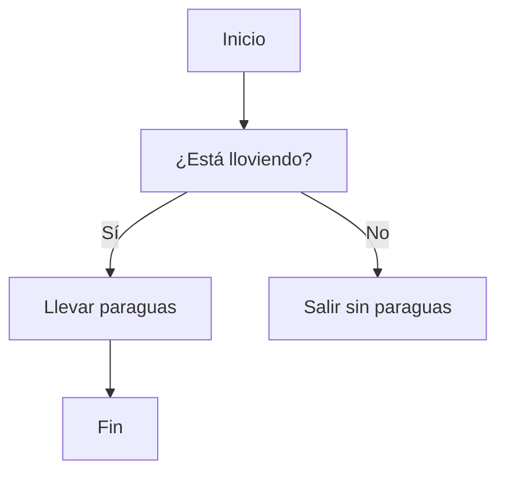

# paquetes

## Introducción a los paquetes en Python

Esta clase trata sobre como crear e importar paquetes en Python, practicando Git.

## Diagrama

```mermaid
flowchart TD
    A[Inicio] --> B[¿Está lloviendo?]
    B --> |Sí| C[Llevar paraguas]
    B --> |No| D[Salir sin paraguas]
    C --> E[Fin]
```